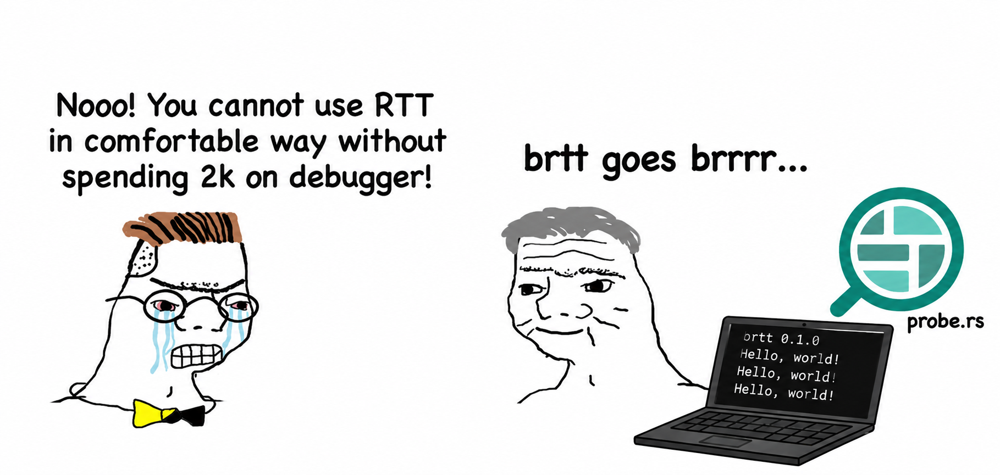

# brtt - Better RTT Client

`brtt` is a host program for interacting with RTT channels on a target device. It is primarily designed to be used as a terminal for the Zephyr shell, providing a seamless debugging and interaction experience.



## Usage

```
brtt [OPTIONS]
```

### Options

- `-p, --probe <PROBE>`: Specify the probe number. Use `list` to see all available probes. A single available probe is selected automatically; multiple probes prompt for a selection.
- `-c, --chip <CHIP>`: Specify the target chip type (e.g., `nRF52840_xxAA`). If not provided, `brtt` will attempt to auto-detect it.
- `-l, --list`: Attach to the target, list available RTT up and down channels, and exit. `--chip`, `--scan-region`, and `--elf` may be used to help discover RTT.
- `-u, --up <CHANNEL[:MODE]>`: The RTT "up" channel (target to host) to use. `MODE` can be `ascii` or `defmt` and defaults to `ascii`. Defaults to channel 0 and may be repeated.
- `-d, --down <CHANNEL>`: The RTT "down" channel (host to target) for keyboard input. Only one channel is supported and it defaults to channel 0.
- `--no-down`: Disable the default down channel and keyboard input for output-only sessions.
- `-r, --reset`: Reset the target after opening the RTT session.
- `-t, --timestamp`: Enable local date and time timestamps with millisecond precision. `Ctrl-T t` toggles them during a session.
- `--poll-interval <MILLISECONDS>`: Polling interval for RTT and keyboard input. [default: 10]
- `--scan-region <SCAN_REGION>`: Specify a memory region to scan for the RTT control block. Can be an exact address (e.g., `0x20000000`) or a range (e.g., `0x20000000..0x20010000`).
- `--elf <PATH>`: ELF containing a defined `_SEGGER_RTT` symbol and, optionally, a defmt table. Required for `:defmt` channels; its symbol takes precedence over `--scan-region`.
- `--debug-defmt-table`: Print defmt table metadata and exit.
- `--defmt-filter <SPEC>`: Filter defmt output, for example `warn` or `app=debug,warn`.
- `--color <auto|always|never>`: Select terminal coloring for channel labels and defmt levels.
- `-L, --log <PATH>`: Write session output to a log file.
- `--log-per-channel`: Write separate `.chN` files instead of one merged log.
- `--log-format <decoded|raw>`: Log decoded text or exact RTT bytes. Raw merged logs require a single up channel.

### Example: nRF54L15 with two up channels

This monitors the ASCII terminal on channel 0 and defmt output on channel 1:

```sh
brtt --release -- \
  --chip nRF54L15 \
  --up 0:ascii \
  --up 1:defmt \
  --elf "path/to/elf"
```

When multiple up channels are selected, terminal output is prefixed with `[chN]`. Channel prefixes use a stable automatic color palette when color output is enabled. Log files never contain ANSI color escapes.

Unsupported combinations fail before probe discovery. Defmt channels require `--elf`; `--defmt-filter` requires a defmt channel; duplicate up channels and `--down` with `--no-down` are rejected; logging modifiers require `--log`; and `--poll-interval 0` is invalid. For `--list`, target discovery options are allowed, while session options such as `--up`, `--down`, `--reset`, timestamps, filters, and logging are rejected.

When neither `--elf` nor `--scan-region` is supplied, RTT discovery uses the target-specific scan ranges from probe-rs.

Internal diagnostics are written to stderr and warnings are shown by default. Set `RUST_LOG=brtt=debug` or `RUST_LOG=brtt=trace` to see additional discovery details. RTT channel data remains on stdout.

Defmt filters apply only to frames already sent by the target. A module-specific filter changes that module while leaving other modules unchanged: `app=debug` shows debug-or-higher messages from `app` and leaves other modules at their normal level. Use `warn,app=debug` for a warning threshold globally with a more verbose `app` override.

Decoded logs buffer incomplete lines until a newline is received. Buffered text is flushed when the session exits normally or reports an error. Raw logs preserve the exact RTT bytes, including malformed defmt data.

## Nix

The flake provides a reproducible source build for the supported Unix systems.

Install the latest package directly:

```sh
nix profile install github:michal4132/brtt
```

Use it from another flake without writing a derivation:

```nix
inputs.brtt.url = "github:michal4132/brtt";

# Use inputs.brtt.packages.${system}.default in a package list.
```

The flake also exports `overlays.default` for users who prefer
`pkgs.brtt` after adding the overlay to their nixpkgs import.

During a session, press `Ctrl-T` followed by a command key:

- `q`: Quit.
- `?`: Show command help.
- `c`: Show the current configuration.
- `l`: Clear the screen.
- `t`: Toggle timestamps.
- `e`: Toggle local echo.
- `R`: Reset the target.
- `Ctrl-T`: Send a literal `Ctrl-T` to the down channel.
